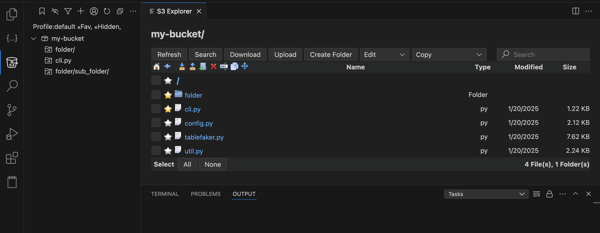
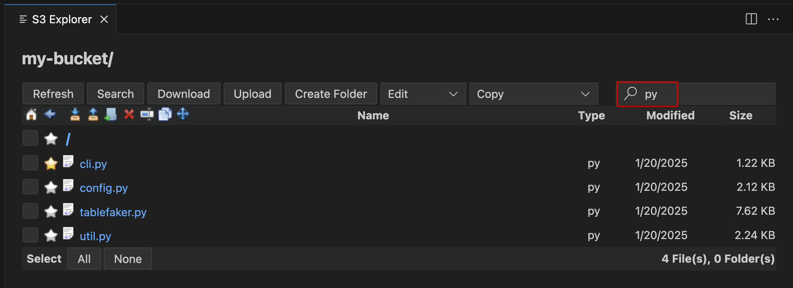
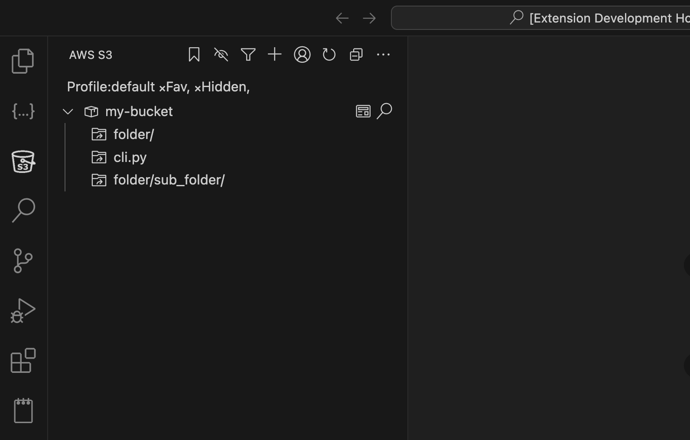
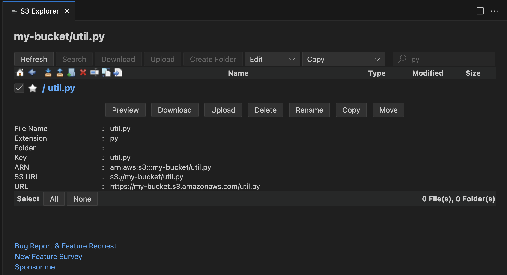
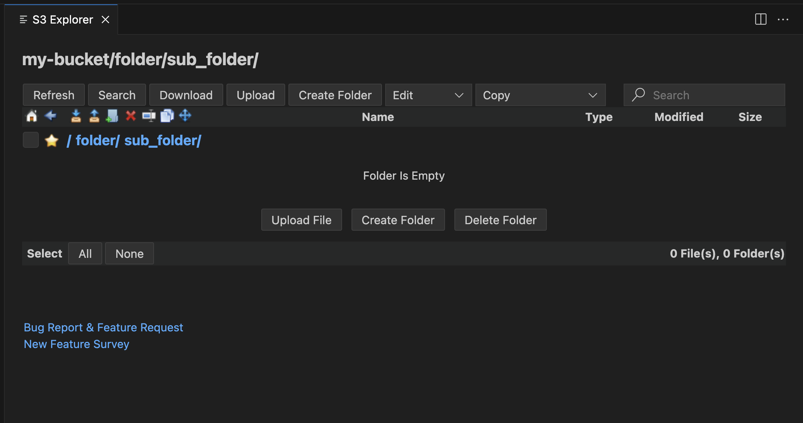
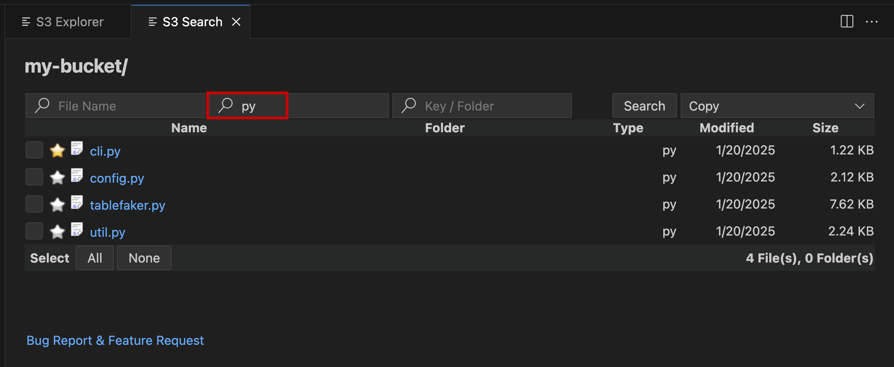
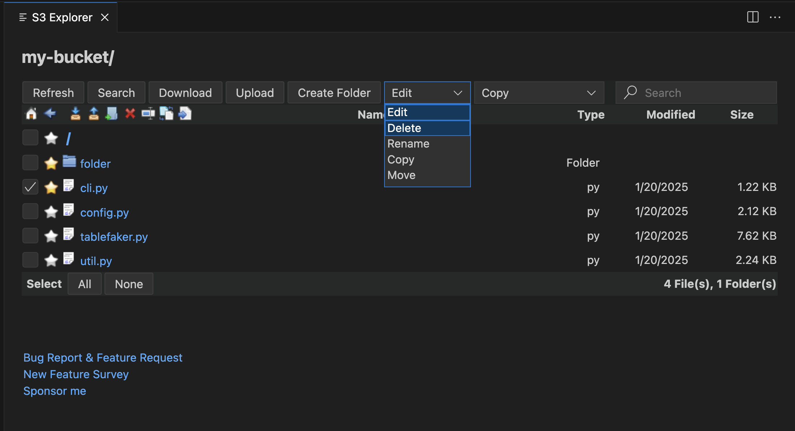
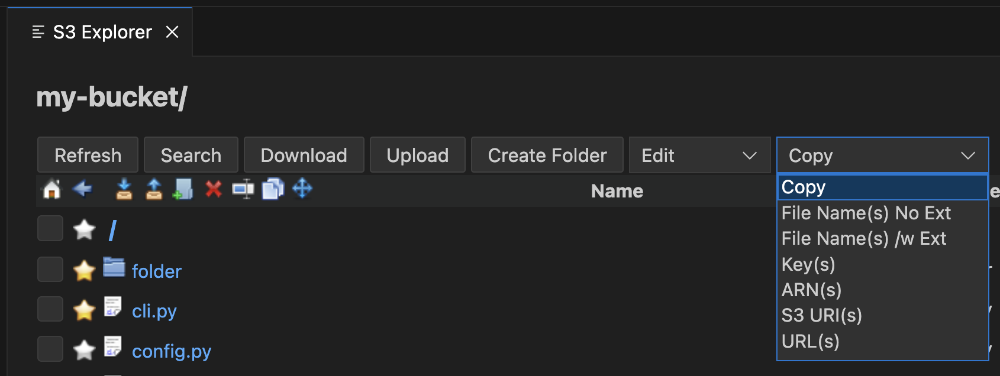

# Aws S3 

The AWS S3 Browser extension for Visual Studio Code allows users to easily browse and manage their Amazon S3 buckets, files and folders within the vscode editor.

With this extension, users can perform a variety of tasks such as 
- Uploading, downloading and deleting files
- Creating and deleting folders
- Copying file names, keys, ARNs, URLs and S3 URIs
- Adding shortcuts to files and folders for easy to access
- Searching All Bucket by File Name, Extension, Folder and Key
- Updating AWS EndPoint (to test your S3 functionality in your localstash environment)

The AWS S3 Browser extension is a useful tool for anyone working with S3, whether you are a developer, data scientist, or system administrator. \
It provides an intuitive and user-friendly interface for managing S3 resources.

## Survey
Please take this survey to help me make the extension better.\
https://bit.ly/s3-extension-survey

## Search

## Buckets & Shortcuts

## File

## Folder

## Global Search

## Edit Menu

## Copy Menu

## Aws Credentials Setup
To Access Aws, you need to configure aws credentials.
For more detail on aws credentials \
https://docs.aws.amazon.com/cli/latest/userguide/cli-configure-files.html \
https://www.youtube.com/watch?v=SON8sY1iOBU

## Bug Report
To report your bugs or request new features, use link below\
https://github.com/necatiarslan/aws-s3/issues/new

## Todo
- Hide shortcuts, add show hidden filter button [H]
- Move, Copy, Rename files
- S3.getBucketAcl to get permissions and enable/disable command buttons
- Sort By Name / Type
- Delete Folder with files in it
- Write Selected File and Folder count to the bottom
- Paging (now max 1000)
- Fix: Cannot read properties of null (reading '_panel')
- Drag/Drop files and folders to upload
- Show progressbar when uploading, downloading, deleting etc
- Freeze top bar
- File count in a folder (option)
- Filter by Date/Size
- Multiple S3 Explorer
- Highlight Icons On Hover
- Copy Shortcut
- GoTo Key
- Add Folder Shortcuts With Search Key
- Add Survey Link to the S3 Explorer and Tree Other Command
- Add Bug Report to the Tree Other Command
- Remove Search Button from S3 Explorer
- Auto Refresh Checkbox
- Theme support

Follow me on linkedin to get latest news \
https://www.linkedin.com/in/necati-arslan/

Thanks, \
Necati ARSLAN \
necatia@gmail.com