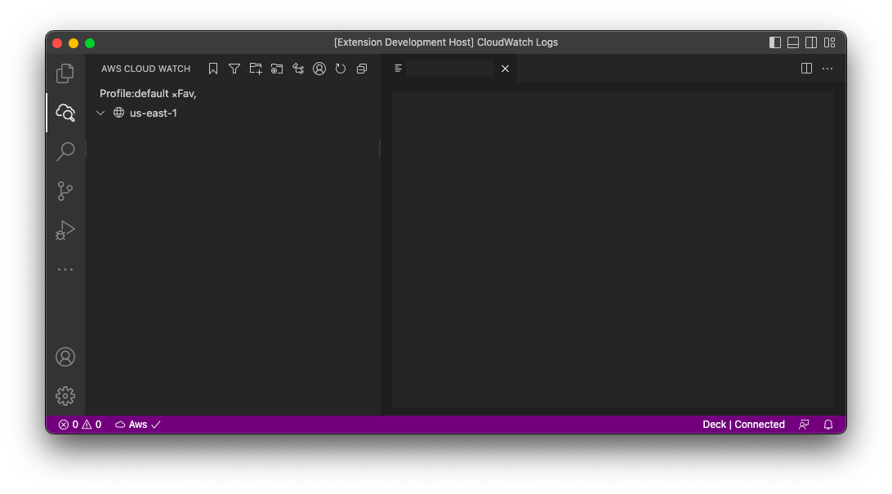

# Aws S3 
The AWS S3 Browser extension for Visual Studio Code allows users to easily browse and manage their Amazon S3 buckets and files from within the code editor. \
With this extension, users can perform a variety of tasks such as uploading and downloading files, creating and deleting buckets, and viewing and editing file metadata.

One of the key features of the AWS S3 Browser extension is its integration with the AWS CLI, which allows users to access S3 directly from the command line. \
This makes it easy to perform batch operations on files and folders, or to automate processes using scripts.

The extension also includes a number of helpful features to make it easier to manage S3 resources. \
For example, users can use the built-in file preview feature to quickly view the contents of a file without leaving the code editor. \
Additionally, the extension provides automatic error handling and retries for failed operations, making it more reliable and easier to use.

Overall, the AWS S3 Browser extension is a useful tool for anyone working with S3, whether you are a developer, data scientist, or system administrator. \
It provides an intuitive and user-friendly interface for managing S3 resources, and its integration with the AWS CLI makes it a powerful tool for automating tasks and streamlining workflows.

## Aws Credentials Setup
To Access Aws, you need to configure aws credentials.
For more detail on aws credentials \
https://docs.aws.amazon.com/cli/latest/userguide/cli-configure-files.html \
https://www.youtube.com/watch?v=SON8sY1iOBU

## Bug Report
To report your bugs or request new features, use link below\
https://github.com/necatiarslan/aws-s3/issues/new

Follow me on linkedin to get latest news \
https://www.linkedin.com/in/necati-arslan/

Thanks, \
Necati ARSLAN \
necatia@gmail.com