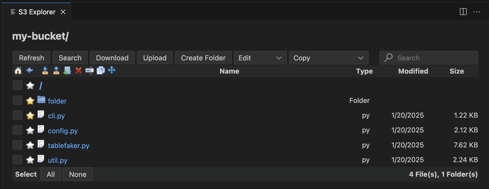

# AWS S3 Browser Extension for Visual Studio Code

The **AWS S3 Browser** extension for Visual Studio Code empowers users to seamlessly browse and manage their Amazon S3 buckets, files, and folders directly within the VS Code editor.

## Features

With this extension, you can efficiently perform a wide range of tasks, including:

- **File Management**:  
  - Rename, copy, move, delete, upload, and download files.  

- **Folder Management**:  
  - Create, rename, copy, move, delete, and download folders.  

- **Enhanced Copying Options**:  
  - Copy file names (with or without extensions), keys, ARNs, URLs, and S3 URIs.  

- **Shortcuts**:  
  - Add shortcuts to frequently accessed files and folders for quick access.  

- **Advanced Search**:  
  - Search across all buckets using file names, extensions, folders, or keys.  

- **Endpoint Customization**:  
  - Configure AWS endpoint URLs for flexibility.  

- **Localstack Support**:  
  - Work with Localstack to emulate S3 for development and testing.  

## Why Use It?

Whether you’re a developer, data scientist, or system administrator, the **AWS S3 Browser** extension simplifies your workflow with an intuitive, user-friendly interface designed to make S3 resource management faster and more convenient.

## Survey
Please take this survey to help me make the extension better.\
https://bit.ly/s3-extension-survey

## Explorer
Explorer is the main view of the extension. It lists all the files and folders in the selected bucket.

## Search Function
Search for files and folders by name and extension listed in the explorer. Subfolders are not searched.
Search is case insensitive.

## Buckets & Shortcuts
To add a bucket click on the `+` button. Then enter part of your bucket name or leave it empty to get all your buckets. Then select buckets to add and click `Add`.
You can add a shortcut for frequently accessed files or folders. 

## File View

## Folder View

## Search View
You can search for files including subfolders. you can use file/folder name, extension or key to search. By clicking  the item on the results, you can go to the s3 explorer.
To open search view click on the `Search` button on the explorer or magnify icon on the treeview bucket item.
You can search for the entire bucket or a specific folder.

## Edit Menu

## Copy Menu

## Endpoint Url
You can change your aws endpoint url here. To connect your localstack use the following url: http://localhost:4566

## Aws Credentials Setup
To Access Aws, you need to configure aws credentials. 

For more detail on aws credentials \
https://docs.aws.amazon.com/cli/latest/userguide/cli-configure-files.html \
https://www.youtube.com/watch?v=SON8sY1iOBU

## Bug Report
To report your bugs or request new features, use link below\
https://github.com/necatiarslan/aws-s3/issues/new

## Todo
- Add "Calculate Folder Size" Button but folder view and show folder size
- Show warning when item is more then 1000
- Add donate button
- Drag/Drop files and folders to upload
- Show progressbar when uploading, downloading, deleting etc
- (node:59796) NOTE: The AWS SDK for JavaScript (v2) is in maintenance mode.
SDK releases are limited to address critical bug fixes and security issues only.
Please migrate your code to use AWS SDK for JavaScript (v3).
For more information, check the blog post at https://a.co/cUPnyil
(Use `Code Helper (Plugin) --trace-warnings ...` to show where the warning was created)
- Sunsetting the Webview UI Toolkit, migrate to alternative
    - https://vscode-elements.github.io/
    - https://github.com/microsoft/fast
    - https://code.visualstudio.com/docs/nodejs/vuejs-tutorial
- NoSuchBucket: The specified bucket does not exist handle error and show error message
## Nice To Have
- Use vscode icons for files and folders
- Auto refresh option
- Paging (now max 1000)
- Sort By Name / Type
- Write Selected File and Folder count to the bottom
- Filter by Date/Size
- Multiple S3 Explorer
- Highlight Icons On Hover
- Freeze top bar
- Fix: Cannot read properties of null (reading '_panel')
- S3.getBucketAcl to get permissions and enable/disable command buttons
- Local folder sync

Follow me on linkedin to get latest news \
https://www.linkedin.com/in/necati-arslan/

Thanks, \
Necati ARSLAN \
necatia@gmail.com

Other Extensions
- https://bit.ly/aws-access-vscode-extension
- https://bit.ly/vscode-aws-s3
- https://bit.ly/aws-cloudwatch-vscode-extension
- https://bit.ly/airflow-vscode-extension