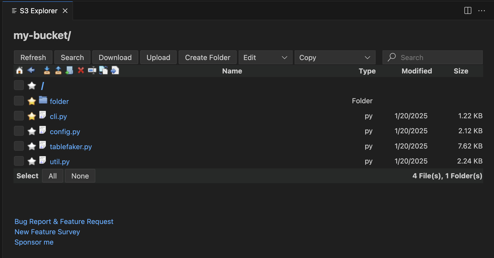
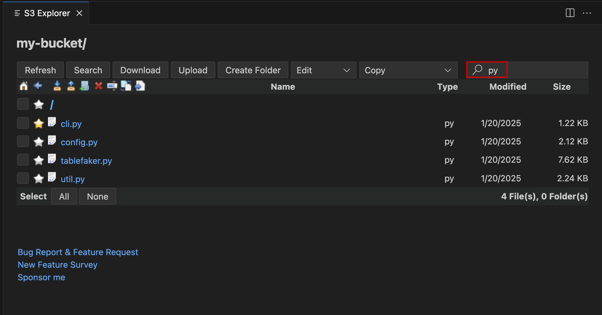
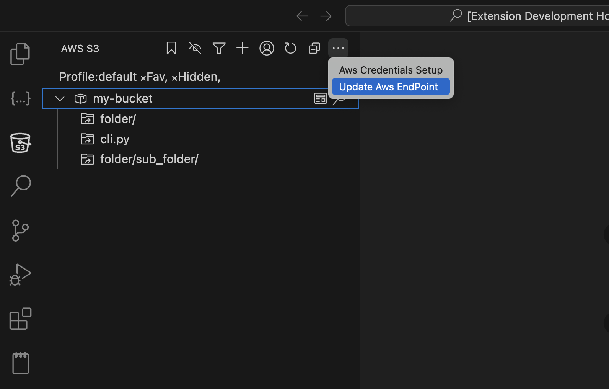

# AWS S3 Extension for Visual Studio Code


The **AWS S3** extension brings the power of Amazon S3 directly into VS Code. Browse, manage, and manipulate buckets, files, and folders without ever leaving your editor.

---

## 📋 Table of Contents
- [Features](#-features)
- [Why Use It?](#-why-use-it)
- [Installation](#-installation)
- [Getting Started](#️-getting-started)
- [Explorer Overview](#-explorer-overview)
- [Search Functionality](#-search-functionality)
- [AI Features](#-ai-features)
- [Buckets & Shortcuts](#-buckets--shortcuts)
- [File & Folder Views](#-file--folder-views)
- [Edit & Copy Menus](#-edit--copy-menus)
- [Endpoint & Credentials](#-endpoint--credentials)
- [Bug Reporting & Contributions](#-bug-reporting--contributions)
- [Roadmap](#️-roadmap)
- [Sponsor & Survey](#-sponsor--survey)
- [Contact](#-contact)

---

## 🚀 Features
- **File Management** – Rename, copy, move, delete, upload, download.
- **Folder Management** – Create, rename, copy, move, delete, download.
- **Copy Options** – File name (with/without extension), key, ARN, URL, S3 URI.
- **Shortcuts** – Pin frequently used files/folders for instant access.
- **Advanced Search** – Search across buckets by name, extension, or key (case‑insensitive).
- **Endpoint & Region Customisation** – Works with custom S3‑compatible endpoints (e.g., LocalStack).
- **Localstack Support** – Seamlessly test against a local S3 emulator.

---

## 🌟 Why Use It?
Whether you’re a developer, data scientist, or sysadmin, this extension streamlines your workflow with an intuitive UI that makes S3 resource management faster and more convenient.

---

## 📦 Installation
1. Open VS Code.
2. Go to **Extensions** (`Ctrl+Shift+X`).
3. Search for **AWS S3** and click **Install**.
4. Reload VS Code if prompted.

---

## 🛠️ Getting Started
1. Open the **AWS S3 Explorer** view from the Activity Bar.
2. Add a bucket using the `+` button (you can filter by name or list all buckets).
3. Browse files/folders, use the context menu for actions, or click the **Search** button for advanced queries.

---

## 📂 Explorer Overview


The Explorer lists all objects in the selected bucket. Use the toolbar to refresh, upload, create folders, or navigate.

---

## 🔎 Search Functionality


Search is case‑insensitive and supports:
- File name
- Extension
- Full key path

Results are displayed in the **Search** view; clicking a result opens it in the Explorer.

---

## 🤖 AI Features

This extension integrates AI capabilities to help you work with S3 more effectively. You can leverage AI through the VS Code chat interface to analyze, manage, and troubleshoot your S3 resources.

### Current Capabilities & Prompts

The AI can execute real S3 operations through available tools. Here are practical prompts based on actual supported operations:

#### List & Browse Objects
- "List all objects in bucket `my-bucket`"
- "Show objects in bucket `my-bucket` with prefix `data/`"
- "List the first 100 objects in bucket `my-bucket`"
- "List all versions of objects in `my-bucket`"

#### Read & Download Files
- "Read the content of `my-bucket/file.txt` as text and analyze it"
- "Get the file `my-bucket/config.json` and display its content"
- "Download `my-bucket/report.csv` to my temp folder"
- "Retrieve metadata for the object `my-bucket/image.jpg`"

#### Create & Write Files
- "Create a file named `settings.json` in `my-bucket` with this content: {json content here}"
- "Write a new file `my-bucket/data.txt` containing the following text"
- "Put an object at `my-bucket/uploads/file.txt`"

#### Copy & Manage Objects
- "Copy the file from `my-bucket/source.txt` to `my-bucket/backup/source.txt`"
- "Duplicate the object `my-bucket/original.pdf` as `my-bucket/copy.pdf`"

#### Delete Objects
- "Delete the object `my-bucket/temp-file.txt`"
- "Remove the file at `my-bucket/old/data.csv`"

#### Query Data with S3 Select
- "Query the CSV file at `my-bucket/sales.csv` using SQL"
- "Use S3 Select to analyze `my-bucket/data.json` with SQL expression"

#### Check Bucket Access & Policy
- "Check if I have access to bucket `my-bucket`"
- "Get the bucket policy for `my-bucket`"
- "Test connection to bucket `my-bucket`"

#### Session & Configuration
- "Switch my AWS profile to `production`"
- "What AWS profiles do I have configured?"
- "Test my AWS connection"

---

## 📁 Buckets & Shortcuts


- Add buckets via the `+` button.
- Create shortcuts for quick access to frequently used objects.

---

## 📄 File & Folder Views
### File View


### Empty Folder View


---

## 🔧 Edit & Copy Menus
### Edit Menu


### Copy Menu


---

## 🌐 Endpoint & Credentials
### Endpoint URL
You can point the extension at any S3‑compatible service (e.g., LocalStack) by setting the endpoint URL:
```
http://localhost:4566
```


### AWS Credentials
The extension follows the standard AWS SDK credential chain:
- **Environment variables** (`AWS_ACCESS_KEY_ID`, `AWS_SECRET_ACCESS_KEY`, `AWS_SESSION_TOKEN`)
- **Shared credentials file** (`~/.aws/credentials` and `~/.aws/config`)
- **EC2 Instance Metadata Service**
- **ECS Container Credentials**
- **AWS SSO**
- **Web Identity Tokens**

For more details, see the [AWS CLI credential docs](https://docs.aws.amazon.com/cli/latest/userguide/cli-configure-files.html).

---

## 🐞 Bug Reporting & Contributions
- **Report bugs / request features**: <https://github.com/necatiarslan/aws-s3/issues/new>
- Contributions are welcome! Fork the repo, make your changes, and submit a pull request.

## 📊 Telemetry & Privacy

This extension collects **anonymous usage telemetry** to help improve reliability and features.

### What is collected
- Extension activation
- Command usage (e.g. S3 upload, download)
- Success and failure signals

### What is NOT collected
- AWS credentials
- Bucket names or object keys
- File paths or file contents
- Personal or identifiable information

### Telemetry control
Telemetry is collected **only if VS Code telemetry is enabled**.
You can disable telemetry via: Settings → Telemetry → Telemetry Level  

---

## 🗺️ Roadmap
### Todo
- MCP support
- A Separate list of s3 buckets to search for buckets and add
- S3 Select support
- Share active profile with other extensions
- Calculate folder size & object count
- Warning for > 1000 items
- Drag‑and‑drop upload
- Detailed error handling (e.g., `NoSuchBucket`)
- Persist favorite/hidden node states
- Progress bars for move/copy/rename operations
- Keep search text per folder navigation

### Nice‑to‑Have
- VS Code icons for files/folders (removed in current version)
- Paging beyond 1000 items
- Display selected file/folder count
- Filter by date/size
- Multiple Explorer instances
- Freeze top bar
- Bucket ACL‑based permission handling
- Local folder sync
- Notes & colour tags for buckets/keys

---

## 🙏 Sponsor & Survey
If you find this extension useful, consider:
- **Sponsoring** me on GitHub: <https://github.com/sponsors/necatiarslan>
- **Taking the survey** to help improve the extension: <https://docs.google.com/forms/d/e/1FAIpQLSdAbmozmNCK-o0Y2wD2mL1HjYSlR1ZKdchR6HXYxBx44AfcLw/viewform?usp=share_link>

---

## 📞 Contact
- **LinkedIn**: <https://www.linkedin.com/in/necati-arslan/>
- **Email**: necatiarslan@gmail.com

---

*Thanks for using the AWS S3 Extension!*